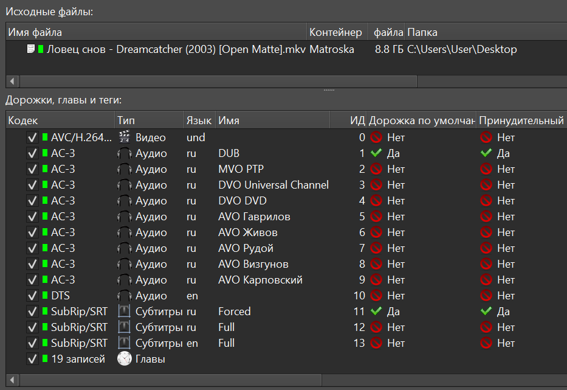
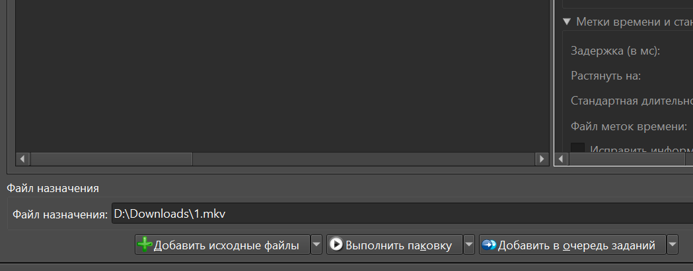

Данная программа предназначена для упрощения размещения видеофайлов
на торрент трекерах.

Для правильной работы, вам необходимо подготовить правильный файл в формате MKV 
(другие типы программа полноценно не принимает).

## Получить ключ для доступа к информации Кинопоиска

Нужно обязательно получить (это бесплатно) ключ доступа к данным [Кинопоиска](https://kinopoiskapiunofficial.tech/signup).
После чего сохранить его в настройках программы.

## Предварительная подготовка файла MKV

Сначала необходимо скачать программу
[MKVToolNix](https://mkvtoolnix.download/downloads.html#windows).

Далее необходимо правильно оформить аудиодорожки и субтитры.

С видеодорожкой делать ничего не надо.

### Аудиодорожки

#### Имя

Имя для аудиодорожки заполняется так: 
`тип перевода` `пробел` `примечание`

Тип перевода:
* `ДБ` или `DUB` - дубляж
* `МП` или `MVO` - многоголосый
* `ДП` или `DVO` - двухголосый
* `АП` или `AVO` - одноголосый авторский
* `Original` - для оригинальной дорожки

Примечание заполняется когда известен автор, источник или студия
перевода и очень желательно.

Правильно:
`ДБ Мосфильм`
`ДП Гланц и Королева`
`АП Гаврилов`
`AVO Горчаков`
`Original`

Если неизвестно чей дубляж или перевод, то заполните хотя бы тип перевода,
иначе будет ошибка.

#### Язык

Обязательно надо указать язык аудио дорожек и субтитров.

#### Субтитры

При наличии форсированных субтитров, например перевод на непереведенные места,
обязательно поставьте их первыми
и укажите галочки: дорожка по умолчанию и предварительный показ.
Если форсированных субтитров нет, а есть только обычные, то галочки надо снять.

Когда все будет готово, нужно сохранить изменения нажав на "Выполнить паковку", 
предварительно дав файлу название.

